# RDP Web Client

Browser-based Remote Desktop client using vanilla JavaScript frontend and a Python WebSocket proxy with native FreeRDP3 integration.

It is a works for me project, but looking forward to any contributors.

## Architecture

```
┌───────────────────────────────────────────────────────┐                                         
│                      Browser                          │                                         
│  ┌─────────────┐  ┌────────────┐  ┌─────────────────┐ │     WebSocket       ┌─────────────────┐     RDP/GFX    ┌─────────┐
│  │ Main Thread │  │ GFX Worker │  │  AudioWorklet   │ │ ◄─────────────────► │  Python Proxy   │ ◄────────────► │ Windows │
│  │  (WS, Opus  │  │ (Offscreen │  │  (Low-latency   │ │  Wire Format Proto  │ (Native FreeRDP)│  AVC444/AVC420 │   OS    │
│  │   Decoder)  │  │  Canvas)   │  │   Ring Buffer)  │ │  H264+SURF+TILE+... │                 │                │         │
│  └─────────────┘  └────────────┘  └─────────────────┘ │                     └─────────────────┘                └─────────┘
└───────────────────────────────────────────────────────┘                                         
```

### Components

- **Frontend**: Vanilla JavaScript SPA with GFX Worker (OffscreenCanvas) served by nginx (port 8000)
- **Backend**: Python WebSocket server with native C library for FreeRDP3 integration (port 8765)
- **Native Bridge**: C library (`librdp_bridge.so`) for direct RDP connection with GFX event streaming
- **Wire Protocol**: Binary message format with 4-byte ASCII magic headers for efficient frame transmission

## Features

- 🎬 **RDP GFX pipeline with H.264/AVC444** - Hardware-accelerated video streaming
- 🔄 **AVC444 → 4:2:0 transcoding** - Server-side FFmpeg conversion for browser compatibility
- 🖼️ **Off-main-thread rendering** - GFX Worker with OffscreenCanvas for smooth 60fps
- 🧩 **Wire format protocol** - Binary messages with typed headers (SURF, TILE, H264, etc.)
- 🎯 **Client-side GFX compositor** - Surface management, tile decoding, frame composition
- 🧮 **Progressive codec WASM decoder** - RFX Progressive tiles decoded in WebAssembly (pthreads)
- 🎨 **ClearCodec WASM decoder** - Clear codec tiles decoded in WebAssembly
- 🔊 **Low-latency audio** with AudioWorklet + SharedArrayBuffer ring buffer (~5-20ms latency)
- 🎵 Native audio streaming with Opus encoding (per-session isolation)
- ⌨️ Full keyboard support with scan code translation
- ⌨️ **Virtual on-screen keyboard** - Touch-friendly US layout with modifier support
- 🖱️ Mouse support (move, click, drag, wheel - horizontal & vertical)
- 🖱️ Server cursor support - Remote cursor updates with custom bitmaps and hotspots
- 📺 Fullscreen mode with dynamic resolution
- 📸 **Screenshot capture** - Save the current remote desktop view as an image
- 🤖 **JS-Driven automation** - Programmatic keyboard and mouse control with screenshot functionality for RPA and testing
- 🎨 **Customizable theming** - Built-in presets (dark, light, midnight, high-contrast) and shadow dom for robustness
- 📋 **Bidirectional clipboard** - Text sync between browser and remote session (📋 button pushes local text, remote copies auto-fill local clipboard)
- 💾 **Remember connection** - Host, port and username saved to localStorage (password never stored)
- 📊 Latency monitoring (ping/pong)
- 🩺 Health check endpoint (`/health`)
- 🐳 Docker support with multi-stage builds
- 👥 Multi-user support (isolated RDP sessions per WebSocket connection)

## Todo (Best Effort)
- File transfer support

## Tech Stack

### Backend
- **Python 3.x** with `websockets` for async WebSocket server
- **Native C library** built with FreeRDP3 SDK (compiled from source with H.264 support)
- **RDPGFX channel** for H.264/AVC444 video (MS-RDPEGFX protocol)
- **GFX Event Queue** - Thread-safe queue streaming raw GFX events to frontend
- **FFmpeg (libavcodec)** for AVC444 → 4:2:0 transcoding
- **RDPSND bridge plugin** for direct audio capture (no PulseAudio or Alsa required)
- **libopus** for Opus audio encoding (64kbps, 20ms frames)
- **Ubuntu 24.04** base image

> **Note**: Ubuntu's FreeRDP3 package is compiled *without* H.264 support. The Docker build 
> compiles FreeRDP3 from source with `-DWITH_FFMPEG=ON` to enable H.264/AVC444 codec negotiation.

### Frontend
- **Vanilla JavaScript** (no frameworks, ES modules)
- **GFX Worker** - Web Worker for off-main-thread rendering
- **OffscreenCanvas** - Hardware-accelerated canvas in worker context (REQUIRED)
- **WebCodecs VideoDecoder** for H.264 decoding in worker (hardware accelerated)
- **WebCodecs AudioDecoder** for Opus decoding (main thread)
- **AudioWorklet** - Low-latency audio playback with SharedArrayBuffer ring buffer
- **Wire Format Parser** - Binary protocol with 4-byte ASCII magic headers
- **nginx:alpine** for static file serving

### Browser Requirements
- **Chrome 94+** or **Edge 94+** or **Safari 26+** or **Firefox 130+**
- **OffscreenCanvas** support (REQUIRED - no fallback)
- **WebCodecs** support (REQUIRED - no fallback)
- **SharedArrayBuffer** support (REQUIRED - no fallback)
- **AudioWorklet** support (REQUIRED - no fallback)

> **Note**: SharedArrayBuffer requires CORS isolation headers (`Cross-Origin-Opener-Policy: same-origin` and `Cross-Origin-Embedder-Policy: require-corp`). These are already configured in the included `nginx.conf`.

## Quick Start with Docker (Recommended)

The easiest way to run the application is using Docker Compose:

```bash
# Build and start both services
docker-compose up -d

# View logs
docker-compose logs -f

# Stop services
docker-compose down
```

- **Frontend**: http://localhost:8000 (nginx proxies same-origin `/ws/` to the backend, override with `BACKEND_UPSTREAM=host:8765`)
- **Health Check**: http://localhost:8000/health

> Prebuilt multi-arch images (amd64/arm64) are published to GHCR on every push to `main` via `.github/workflows/docker-publish.yml` (`freerdp-web-backend` / `freerdp-web-frontend`).

## Manual Setup

### Backend

The backend requires building the native C library against FreeRDP3. This is best done inside Docker.

```bash
cd backend
docker build -t rdp-backend .
docker run --rm -it -p 8765:8765 rdp-backend
```

### Frontend

```bash
cd frontend
docker build -t rdp-frontend .
docker run --rm -it -p 8000:8000 rdp-frontend

# Then open http://localhost:8000
```

## Frontend Integration

The RDP client is available as a reusable ES module with Shadow DOM isolation, making it easy to integrate into any web application.

### Required HTTP Headers (when building your own web server)

Generate the WASM decoder and javascript files by running the included PowerShell script:
```pwsh
# the below script will build all files and but it into the 'wasmbuild' folder
justbuildwasm.ps1
# copy the contents of the 'wasmbuild' folder to your web server's static file directory
cp -r wasmbuild/* /path/to/your/webserver/
```

The frontend requires cross-origin isolation headers for SharedArrayBuffer support (used by WASM pthreads). Your web server must include these headers:

```nginx
# Required for SharedArrayBuffer (WASM pthreads)
# These headers enable cross-origin isolation
add_header Cross-Origin-Opener-Policy "same-origin" always;
add_header Cross-Origin-Embedder-Policy "require-corp" always;
```

Without these headers, the progressive codec WASM decoder will not function. The included `nginx.conf` already has these configured.

### Quick Start

#### 1. Import the module

```javascript
import { RDPClient } from './rdp-client.js';
```

#### 2. Create an instance

```javascript
const client = new RDPClient(document.getElementById('container'), {
  showTopBar: true,    // Show/hide the connection toolbar
  showBottomBar: true  // Show/hide the status bar
});
// WebSocket defaults to same-origin `/ws/` (nginx proxies to backend).
// Debug override: `?wsUrl=/custom-path` or pass `wsUrl` explicitly.
```

#### 3. Connect programmatically

```javascript
await client.connect({
  host: '192.168.1.100',
  port: 3389,
  user: 'Administrator',
  pass: 'password'
});
```

### Configuration Options

| Option | Type | Default | Description |
|--------|------|---------|-------------|
| `wsUrl` | string | same-origin `/ws/` | WebSocket server URL (defaults to same-origin `/ws/` proxied by nginx; `?wsUrl=/path` overrides for debug) |
| `showTopBar` | boolean | `true` | Show/hide the top toolbar |
| `showBottomBar` | boolean | `true` | Show/hide the bottom status bar |
| `reconnectDelay` | number | `3000` | Reconnection delay in milliseconds |
| `mouseThrottleMs` | number | `16` | Mouse move event throttle (~60fps) |
| `resizeDebounceMs` | number | `2000` | Resize debounce delay |
| `keepConnectionModalOpen` | boolean | `false` | Keep connection modal open when not connected |
| `loadingSpinnerOpensModal` | boolean | `true` | Clicking on the loading area opens the connection modal |
| `minWidth` | number | `0` | Minimum canvas width in pixels (0 = no minimum, scrollbar appears if container is smaller) |
| `minHeight` | number | `0` | Minimum canvas height in pixels (0 = no minimum, scrollbar appears if container is smaller) |
| `theme` | object | `null` | Theme configuration (see Theming section) |
| `securityPolicy` | object | `null` | Security policy for connection restrictions (see Security Policy section) |
| `visibleTopBarButtons` | object | `{ connect: true, disconnect: true, screenshot: true, fullscreen: true }` | Control visibility of top bar buttons |
| `additionalTopBarButtons` | array | `[]` | Custom buttons (max 4) added before built-in controls |

#### visibleTopBarButtons Options

| Property | Type | Default | Description |
|----------|------|---------|-------------|
| `connect` | boolean | `true` | Show/hide the Connect button |
| `disconnect` | boolean | `true` | Show/hide the Disconnect button |
| `screenshot` | boolean | `true` | Show/hide the Screenshot button (📷) |
| `fullscreen` | boolean | `true` | Show/hide the Fullscreen button (⛶) |

```javascript
// Example: Hide screenshot and fullscreen buttons
const client = new RDPClient(container, {
    visibleTopBarButtons: {
        connect: true,
        disconnect: true,
        screenshot: false,
        fullscreen: false
    }
});
```

#### additionalTopBarButtons Options

Add up to 10 custom buttons to the top bar. Buttons are inserted before the built-in controls (Connect, Disconnect, etc.).

| Property | Type | Required | Description |
|----------|------|----------|-------------|
| `name` | string | Yes | Button label text (also used as tooltip) |
| `click` | function | Yes | Callback function invoked when button is clicked |

**Security Note**: Click callbacks are isolated and cannot access RDPClient internals. The callback receives a simple object `{ buttonName: string }` as its only argument.

```javascript
// Example: Add custom buttons (remove Connect button and add Reconnect button)
const client = new RDPClient(container, {
    visibleTopBarButtons: {
        connect: false
    },
    loadingSpinnerOpensModal: false,
    additionalTopBarButtons: [
        {
            name: 'Reconnect',
            click: async () => {
                // disconnect if connected
                if (client.isConnected()) {
                    await client.disconnect();
                }
                // then connect
                await client.connect({
                    host: '1.2.3.4',
                    port: 3389,
                    user: 'user1',
                    pass: 'passwd'
                });
            }
        },
    ]
});
```

### Security Policy

The RDP client supports a security policy to restrict which destinations users can connect to. This is useful for enterprise deployments where you want to limit connections to approved hosts only.

The security policy is **immutable by design** - it uses JavaScript private class fields and deep freezing to prevent tampering after initialization.

**Want to learn more?** See the complete [Security Policy Guide](./CREATING-SECURITY-POLICY.md) for detailed explanations, examples, and best practices.

#### Quick Start

```javascript
const client = new RDPClient(container, {
    securityPolicy: {
        allowedHostnames: ['*.internal.corp', 'rdp.example.com'],
        allowedIpv4Cidrs: ['10.0.0.0/8', '192.168.1.0/24'],
        allowedDestinationRegex: ['^prod-server-\\d+:3389$']
    }
});
```

#### Security Policy Options

| Property | Type | Description |
|----------|------|-------------|
| `allowedHostnames` | `string[]` | Glob patterns for allowed hostnames (IPs are ignored) |
| `allowedIpv4Cidrs` | `string[]` | CIDR ranges for allowed IPv4 addresses (non-IPs are ignored) |
| `allowedDestinationRegex` | `string[]` | Regex patterns matched against `host:port` strings (does not matter if ip or hostname) |

> **Note**: If no security policy is provided, or if all arrays are empty, all connections are allowed. When at least one rule is defined, only destinations matching at least one rule will be permitted.

#### Backend Security Policy (Environment Variables Fallback)

The backend primarily loads security policies from a JSON file (see [Security Policy Guide](./CREATING-SECURITY-POLICY.md)). As a fallback when no file-based policy exists, the backend can load policies from environment variables:

```bash
export SECURITY_ALLOWED_HOSTNAMES="*.internal.mycompany.com, *.prod.mycompany.com"
export SECURITY_ALLOWED_IPV4_CIDRS="10.0.0.0/8, 172.16.0.0/12"
export SECURITY_ALLOWED_DEST_REGEX="^jumpbox\\.dmz\\.mycompany\\.com:3389$"
export SECURITY_ALLOWED_DEST_REGEX_1="^backup\\.corp:3389$"
```

> ⚠️ **Not Recommended**: Environment variable configuration is provided only as a fallback. **The file-based approach is highly recommended** for production deployments. See [CREATING-SECURITY-POLICY.md](./CREATING-SECURITY-POLICY.md) for details.

#### Hostname Glob Patterns

The `allowedHostnames` option supports full glob pattern matching:

| Pattern | Description | Example Matches |
|---------|-------------|-----------------|
| `*` | Matches any sequence of characters | `*.example.com` matches `server.example.com`, `db.example.com` |
| `?` | Matches exactly one character | `web?.prod` matches `web1.prod`, `webA.prod` |
| `[abc]` | Matches any character in the set | `server[123].corp` matches `server1.corp`, `server2.corp` |
| `[!abc]` | Matches any character NOT in the set | `db[!0].prod` matches `db1.prod`, `dbA.prod` but not `db0.prod` |

Hostname matching is **case-insensitive**.

```javascript
securityPolicy: {
    allowedHostnames: [
        '*.internal.corp',           // All subdomains of internal.corp
        'rdp-server-??.prod',        // rdp-server-01.prod through rdp-server-99.prod
        'web[123].example.com',      // web1, web2, or web3.example.com
        'dev-*',                     // Anything starting with "dev-"
        'exact-host.mycompany.com',  // Exact match only
    ]
}
```

#### IPv4 CIDR Ranges

The `allowedIpv4Cidrs` option accepts standard CIDR notation:

```javascript
securityPolicy: {
    allowedIpv4Cidrs: [
        '10.0.0.0/8',        // All 10.x.x.x addresses (Class A private)
        '172.16.0.0/12',     // 172.16.x.x - 172.31.x.x (Class B private)
        '192.168.1.0/24',    // 192.168.1.0 - 192.168.1.255
        '192.168.100.50/32', // Single IP: 192.168.100.50 only
    ]
}
```

| CIDR | Range | Host Count |
|------|-------|------------|
| `/32` | Single IP | 1 |
| `/24` | x.x.x.0 - x.x.x.255 | 256 |
| `/16` | x.x.0.0 - x.x.255.255 | 65,536 |
| `/8` | x.0.0.0 - x.255.255.255 | 16,777,216 |

#### Destination Regex Patterns

The `allowedDestinationRegex` option matches against the full `host:port` string, allowing complex rules that consider both hostname/IP and port:

```javascript
securityPolicy: {
    allowedDestinationRegex: [
        '^.*:3389$',                    // Any host, but only port 3389
        '^prod-server-\\d+:3389$',      // prod-server-01:3389, prod-server-99:3389, etc.
        '^192\\.168\\.1\\.\\d+:33[89]\\d$', // 192.168.1.x on ports 3380-3399
        '^(web|app|db)\\.corp:3389$',   // web.corp, app.corp, or db.corp on 3389
    ]
}
```

> **Note**: Regex patterns are applied to both hostnames and IP addresses. Remember to escape special regex characters like `.` and `\`.

#### Combining Rules (OR Logic)

When multiple rule types are defined, a connection is allowed if it matches **any** rule:

```javascript
securityPolicy: {
    // Connection allowed if it matches ANY of these:
    allowedHostnames: ['*.internal.corp'],           // OR any internal.corp subdomain
    allowedIpv4Cidrs: ['10.0.0.0/8'],                // OR any 10.x.x.x IP
    allowedDestinationRegex: ['^backup-server:3390$'] // OR backup-server on port 3390
}
```

#### Validation API

You can check if a destination would be allowed before attempting to connect:

```javascript
// Check a destination
const result = client.validateDestination('192.168.1.50', 3389);
if (result.allowed) {
    console.log('Connection would be allowed');
} else {
    console.log('Blocked:', result.reason);
}

// Get the current policy (read-only, frozen)
const policy = client.getSecurityPolicy();
console.log(policy.allowedHostnames);  // Cannot be modified
```

#### Enterprise Example

```javascript
const client = new RDPClient(container, {
    wsUrl: 'wss://rdp-proxy.mycompany.com',
    keepConnectionModalOpen: true,
    securityPolicy: {
        // Allow corporate hostnames
        allowedHostnames: [
            '*.internal.mycompany.com',
            '*.prod.mycompany.com',
            '*.dev.mycompany.com',
        ],
        // Allow corporate IP ranges
        allowedIpv4Cidrs: [
            '10.0.0.0/8',       // Corporate network
            '172.16.0.0/12',    // VPN ranges
        ],
        // Special cases with port restrictions
        allowedDestinationRegex: [
            '^jumpbox\\.dmz\\.mycompany\\.com:3389$',
        ]
    },
    theme: { preset: 'light' }
});

// User attempts to connect - automatically validated
client.connect({ host: '10.50.100.25', user: 'admin', pass: 'secret' })
    .then(() => console.log('Connected!'))
    .catch(err => console.error('Blocked:', err.message));
```

### Theming

The RDP client supports comprehensive theming through a semantic, type-safe API. You can use built-in presets or create custom themes with fine-grained control over colors, typography, and shape.

> 📖 **Want to create your own theme?** See the complete [Creating Custom Themes Guide](./CREATING-THEMES.md) for step-by-step instructions, all available options, and best practices.

#### Built-in Presets

| Preset | Description |
|--------|-------------|
| `dark` | Default theme with deep blue tones |
| `light` | Clean light mode for bright environments |
| `midnight` | Pure dark with purple accents |
| `highContrast` | Accessibility-focused with maximum contrast |

#### Quick Examples

```javascript
import { RDPClient, themes } from './rdp-client.js';

// 1. Default dark theme (no config needed)
const client = new RDPClient(container);

// 2. Use a preset
const client = new RDPClient(container, {
    theme: { preset: 'light' }
});

// 3. Custom accent color
const client = new RDPClient(container, {
    theme: {
        colors: {
            accent: '#00b4d8',
            buttonHover: '#0096c7'
        }
    }
});

// 4. Extend a preset with custom colors
const client = new RDPClient(container, {
    theme: {
        preset: 'dark',
        colors: {
            accent: '#ff5722',
            success: '#4caf50'
        }
    }
});
```

#### Theme Configuration Reference

```javascript
{
    // Optional: Base preset to extend
    preset: 'dark' | 'light' | 'midnight' | 'highContrast',
    
    // Color customization
    colors: {
        background: '#1a1a2e',       // Main background
        surface: '#16213e',          // Panels, modals, toolbars
        border: '#0f3460',           // Borders and separators
        text: '#eeeeee',             // Primary text color
        textMuted: '#888888',        // Secondary/muted text
        accent: '#51cf66',           // Primary accent (focus, active states)
        accentText: '#000000',       // Text on accent backgrounds
        error: '#ff6b6b',            // Error/disconnect state
        success: '#51cf66',          // Success/connected state
        buttonBg: '#0f3460',         // Button background
        buttonHover: '#1a4a7a',      // Button hover background
        buttonText: '#eeeeee',       // Button text color
        buttonActiveBg: '#51cf66',   // Button pressed background
        buttonActiveText: '#000000', // Button pressed text
        inputBg: '#1a1a2e',          // Input field background
        inputBorder: '#0f3460',      // Input field border
        inputFocusBorder: '#51cf66', // Input focus border
    },
    
    // Typography customization
    typography: {
        fontFamily: "-apple-system, BlinkMacSystemFont, 'Segoe UI', Roboto, sans-serif",
        fontSize: '14px',            // Base font size
        fontSizeSmall: '0.85rem',    // Small text (labels, status)
    },
    
    // Shape customization
    shape: {
        borderRadius: '4px',         // Buttons, inputs
        borderRadiusLarge: '8px',    // Modals, overlays
    },
    
    // Custom fonts (loaded into Shadow DOM)
    fonts: {
        googleFonts: ['https://fonts.googleapis.com/css2?family=Inter:wght@400;700&display=swap'],
        fontFaces: [{ family: 'CustomFont', src: 'https://example.com/font.woff2' }]
    }
}
```

#### Dynamic Theme Changes

You can change the theme at runtime using the `setTheme()` method:

```javascript
// Switch to light mode
client.setTheme({ preset: 'light' });

// Change just the accent color
client.setTheme({ 
    colors: { 
        accent: '#e91e63',
        buttonActiveBg: '#e91e63'
    } 
});

// Reset to default dark theme
client.setTheme({ preset: 'dark' });
```

#### Corporate Branding Example

```javascript
const client = new RDPClient(container, {
    theme: {
        preset: 'dark',
        colors: {
            accent: '#0066cc',           // Brand blue
            accentText: '#ffffff',
            success: '#28a745',
            buttonBg: '#2d3748',
            buttonHover: '#4a5568',
            buttonActiveBg: '#0066cc',
            buttonActiveText: '#ffffff',
            inputFocusBorder: '#0066cc',
        },
        typography: {
            fontFamily: "'Inter', 'Helvetica Neue', Arial, sans-serif",
        },
        shape: {
            borderRadius: '6px',
            borderRadiusLarge: '12px',
        }
    }
});
```

#### Accessing Theme Presets

You can access the full theme preset objects for reference or modification:

```javascript
import { themes } from './rdp-client.js';

// Log all available colors in dark theme
console.log(themes.dark.colors);

// Use preset colors in your app
document.body.style.background = themes.midnight.colors.background;
```

### Public API

| Method | Description |
|--------|-------------|
| `connect(credentials)` | Connect to RDP server. Returns a Promise. |
| `disconnect()` | Disconnect the current session. Returns a Promise. |
| `sendKeys(keys, opts)` | Send keystrokes. Options: `{ ctrl, alt, shift, meta, delay }`. Returns a Promise. |
| `sendKeyCombo(combo)` | Send key combination (e.g., `'Ctrl+Alt+Delete'`) |
| `sendCtrlAltDel()` | Shortcut for `sendKeyCombo('Ctrl+Alt+Delete')` |
| `sendBackspace(count)` | Send Backspace key press(es). Default count: 1. Returns a Promise. |
| `sendMouseMove(x, y)` | Move mouse cursor to coordinates (shows visual cursor overlay) |
| `sendMouseClick(opts)` | Perform mouse click. Options: `{ x, y, button, count, delay }`. Returns a Promise. |
| `sendMouseScroll(opts)` | Perform mouse scroll. Options: `{ x, y, deltaX, deltaY }` |
| `showKeyboard()` | Show the virtual on-screen keyboard |
| `hideKeyboard()` | Hide the virtual on-screen keyboard |
| `isKeyboardVisible()` | Returns `true` if virtual keyboard is visible |
| `setTheme(config)` | Apply a new theme configuration dynamically |
| `setMinDimensions(w, h)` | Set minimum canvas dimensions (0 = no minimum, scrollbars appear if container is smaller) |
| `getStatus()` | Returns `{ connected, resolution, muted }` |
| `isConnected()` | Returns `true` if connected to RDP server |
| `getLatency()` | Returns current latency in ms, or `null` if not measured |
| `getMuted()` | Returns current mute state (boolean) |
| `setMuted(bool)` | Set audio mute state |
| `getResolution()` | Returns `{ width, height }` or `null` if not connected |
| `getSecurityPolicy()` | Returns the frozen security policy object (read-only) |
| `validateDestination(host, port)` | Check if destination is allowed. Returns `{ allowed, reason? }` |
| `getScreenshot(type, quality)` | Capture screenshot. Returns `Promise<{ blob, width, height }>`. Type: `'png'` or `'jpg'` |
| `downloadScreenshot(type, quality)` | Capture and download screenshot as `screenshot-YYYY-mm-dd--hh-mm.(png\|jpg)`. Returns a Promise. |
| `on(event, handler)` | Register an event handler |
| `off(event, handler)` | Remove an event handler |
| `destroy()` | Clean up resources and remove from DOM. Returns a Promise. |

### Keyboard & Mouse Input Methods

The RDP client provides programmatic methods for sending keyboard and mouse input to the remote desktop. These are useful for automation, scripting, or building custom UI controls.

> **Visual Cursor**: When using `sendMouseMove`, `sendMouseClick`, or `sendMouseScroll`, a visual cursor overlay appears on the canvas to indicate the programmatic mouse position. This overlay automatically hides when the user moves their real mouse over the canvas.

#### Keyboard Methods

| Method | Async | Description |
|--------|-------|---------
----|
| `sendKeys(keys, options)` | ✅ Yes | Send one or more keystrokes with optional modifiers |
| `sendKeyCombo(combo)` | ❌ No | Send a key combination string (e.g., `'Ctrl+C'`) |
| `sendCtrlAltDel()` | ❌ No | Send `Ctrl+Alt+Delete` |
| `sendBackspace(count)` | ✅ Yes | Send Backspace key press(es) |

##### sendKeys(keys, options)

Send keystrokes to the remote desktop with optional modifier keys.

```javascript
// Send a single character
await client.sendKeys('a');

// Send multiple characters with delay between each
await client.sendKeys('Hello World', { delay: 50 });

// Send with modifiers (Ctrl+S to save)
await client.sendKeys('s', { ctrl: true });

// Send array of keys
await client.sendKeys(['H', 'i', '!'], { delay: 100 });
```

**Options:**
| Property | Type | Default | Description |
|----------|------|---------|-------------|
| `ctrl` | boolean | `false` | Hold Ctrl while sending |
| `alt` | boolean | `false` | Hold Alt while sending |
| `shift` | boolean | `false` | Hold Shift while sending |
| `meta` | boolean | `false` | Hold Meta/Win while sending |
| `delay` | number | `0` | Delay in ms between keystrokes |

##### sendKeyCombo(combo)

Send a key combination using a simple string format.

```javascript
// Common shortcuts
client.sendKeyCombo('Ctrl+C');        // Copy
client.sendKeyCombo('Ctrl+V');        // Paste
client.sendKeyCombo('Alt+Tab');       // Switch windows
client.sendKeyCombo('Ctrl+Alt+Delete'); // Security attention
client.sendKeyCombo('Win+R');         // Run dialog
```

##### sendCtrlAltDel()

Convenience method for sending the `Ctrl+Alt+Delete` security attention sequence.

```javascript
client.sendCtrlAltDel();
```

##### sendBackspace(count)

Send one or more Backspace key presses with a 20ms delay between each. This is an **async** method.

```javascript
// Single backspace
await client.sendBackspace();

// Delete 5 characters
await client.sendBackspace(5);
```

#### Mouse Methods

| Method | Async | Description |
|--------|-------|-------------|
| `sendMouseMove(x, y)` | ❌ No | Move cursor to coordinates |
| `sendMouseClick(options)` | ✅ Yes | Perform mouse click(s) |
| `sendMouseScroll(options)` | ❌ No | Perform scroll operation |

##### sendMouseMove(x, y)

Move the mouse cursor to specific coordinates in remote desktop pixels.

```javascript
// Move to position (100, 200)
client.sendMouseMove(100, 200);

// Move to center of screen
const res = client.getResolution();
client.sendMouseMove(res.width / 2, res.height / 2);
```

##### sendMouseClick(options)

Perform mouse click(s) at the current or specified position. This is an **async** method that returns a Promise.

```javascript
// Left click at current cursor position
await client.sendMouseClick();

// Left click at specific coordinates
await client.sendMouseClick({ x: 500, y: 300 });

// Right click
await client.sendMouseClick({ button: 'right' });

// Double click
await client.sendMouseClick({ x: 100, y: 100, count: 2 });

// Middle click with custom delay between clicks
await client.sendMouseClick({ button: 'middle', count: 3, delay: 100 });
```

**Options:**
| Property | Type | Default | Description |
|----------|------|---------|-------------|
| `x` | number | last position | X coordinate in remote pixels |
| `y` | number | last position | Y coordinate in remote pixels |
| `button` | string | `'left'` | Button: `'left'`, `'right'`, or `'middle'` |
| `count` | number | `1` | Number of clicks (e.g., 2 for double-click) |
| `delay` | number | `50` | Delay in ms between multiple clicks |

##### sendMouseScroll(options)

Perform a scroll operation at the current or specified position.

```javascript
// Scroll down at current position
client.sendMouseScroll({ deltaY: 100 });

// Scroll up
client.sendMouseScroll({ deltaY: -100 });

// Scroll at specific position
client.sendMouseScroll({ x: 500, y: 300, deltaY: 50 });

// Horizontal scroll (right)
client.sendMouseScroll({ deltaX: 50 });

// Horizontal scroll (left)
client.sendMouseScroll({ deltaX: -50 });

// Combined scroll
client.sendMouseScroll({ deltaX: 20, deltaY: 100 });
```

**Options:**
| Property | Type | Default | Description |
|----------|------|---------|-------------|
| `x` | number | last position | X coordinate in remote pixels |
| `y` | number | last position | Y coordinate in remote pixels |
| `deltaX` | number | `0` | Horizontal scroll (positive = right) |
| `deltaY` | number | `0` | Vertical scroll (positive = down) |

#### Automation Example

```javascript
// Simple automation: Open Run dialog and type a command
async function openNotepad(client) {
    // Open Run dialog
    client.sendKeyCombo('Win+R');
    
    // Wait for dialog to appear
    await new Promise(r => setTimeout(r, 500));
    
    // Type command
    await client.sendKeys('notepad', { delay: 30 });
    
    // Press Enter
    client.sendKeyCombo('Enter');
}

// Click automation: Navigate a menu
async function clickFileMenu(client) {
    // Click on File menu (coordinates depend on application)
    await client.sendMouseClick({ x: 30, y: 50 });
    
    // Wait for menu to open
    await new Promise(r => setTimeout(r, 200));
    
    // Click on Save option
    await client.sendMouseClick({ x: 50, y: 120 });
}
```

### Events

| Event | Data | Description |
|-------|------|-------------|
| `'connected'` | `{ width, height }` | RDP session established |
| `'disconnected'` | - | Session ended |
| `'resize'` | `{ width, height }` | Resolution changed |
| `'latency'` | `{ latencyMs }` | Latency measurement updated (every 5 seconds) |
| `'error'` | `{ message }` | Error occurred |
| `'mute'` | `{ muted }` | Audio mute state changed |
| `'keyboardShow'` | - | Virtual keyboard was shown |
| `'keyboardHide'` | - | Virtual keyboard was hidden |

### Virtual Keyboard

The RDP client includes a built-in virtual on-screen keyboard, ideal for touch devices or when physical keyboard access is limited.

#### Features

- **US keyboard layout** (without numeric keypad)
- **Movable & resizable** overlay that stays within canvas bounds
- **Touch-friendly** with support for both mouse and touch events
- **Modifier key toggle** - Shift, Ctrl, Alt, and Win keys stay pressed until a regular key is typed
- **Special key combos**:
  - `Alt+Tab` - Switch windows
  - `Ctrl+Alt+Delete` - Security attention sequence
- **Scalable UI** - Keyboard scales between 60% and 120% of its original size

#### Usage

```javascript
// Show the virtual keyboard
client.showKeyboard();

// Hide the virtual keyboard
client.hideKeyboard();

// Check visibility
if (client.isKeyboardVisible()) {
  console.log('Keyboard is open');
}

// Listen for keyboard events
client.on('keyboardShow', () => console.log('Keyboard opened'));
client.on('keyboardHide', () => console.log('Keyboard closed'));
```

The keyboard can also be toggled using the ⌨️ button in the top toolbar when connected.

### Full Example

```html
<!DOCTYPE html>
<html>
<head>
  <title>My RDP App</title>
  <style>
    #rdp-container {
      width: 100%;
      height: 600px;
    }
  </style>
</head>
<body>
  <div id="rdp-container"></div>
  
  <script type="module">
    import { RDPClient } from './rdp-client.js';

    const client = new RDPClient(document.getElementById('rdp-container'), {
      showTopBar: true,
      showBottomBar: false
    });

    // Event handlers
    client.on('connected', ({ width, height }) => {
      console.log(`Connected at ${width}x${height}`);
    });

    client.on('disconnected', () => {
      console.log('Session ended');
    });

    client.on('error', ({ message }) => {
      console.error('RDP Error:', message);
    });

    client.on('resize', ({ width, height }) => {
      console.log(`Resolution changed to ${width}x${height}`);
    });

    // Connect automatically
    client.connect({
      host: '192.168.1.100',
      port: 3389,
      user: 'admin',
      pass: 'secret'
    }).catch(err => console.error(err));

    // Expose for debugging
    window.rdpClient = client;
  </script>
</body>
</html>
```

## Usage

1. Open http://localhost:8000 in your browser
2. Click **Connect**
3. Enter VM details:
   - **Host**: IP or hostname of Windows VM
   - **Port**: RDP port (default: 3389)
   - **Username**: Windows username
   - **Password**: Windows password
4. Click **Connect** in the modal

## WebSocket Protocol

### Client → Server Messages (JSON Format)

| Type | Description | Fields |
|------|-------------|--------|
| `connect` | Start RDP session | `host`, `port`, `username`, `password`, `width`, `height` |
| `disconnect` | End session | - |
| `mouse` | Mouse event | `action`, `x`, `y`, `button`, `deltaX`, `deltaY` |
| `key` | Keyboard event | `action`, `code`, `key` |
| `resize` | Request resolution change | `width`, `height` |
| `ping` | Latency measurement | - |

### Server → Client Messages (JSON Format)

| Type | Description | Fields |
|------|-------------|--------|
| `connected` | Session started | `width`, `height` |
| `disconnected` | Session ended | - |
| `error` | Error occurred | `message` |
| `pong` | Ping response | - |

### Server → Client Messages (Wire Format)

All binary messages use a 4-byte ASCII magic header for efficient parsing:

| Magic | Type | Description |
|-------|------|-------------|
| `SURF` | createSurface | Create a new GFX surface |
| `DELS` | deleteSurface | Delete a surface |
| `MAPS` | mapSurfaceToOutput | Map surface to primary output |
| `STFR` | startFrame | Begin frame composition |
| `ENFR` | endFrame | End frame, commit to screen |
| `CAPS` | capsConfirm | Server capability confirmation (GFX version/flags) |
| `INIT` | initSettings | RDP session settings (codec flags, color depth) |
| `RSGR` | resetGraphics | Reset all GFX state (surfaces, cache, codec) |
| `H264` | H.264 frame | Encoded video NAL units (AVC420/AVC444) |
| `WEBP` | WebP tile | Compressed image tile |
| `TILE` | Raw tile | Uncompressed RGBA pixels |
| `PROG` | Progressive tile | RFX Progressive compressed (WASM decoded) |
| `CLRC` | ClearCodec tile | ClearCodec compressed (WASM decoded) |
| `SFIL` | solidFill | Fill rectangle with color |
| `S2SF` | surfaceToSurface | Copy region between surfaces |
| `S2CH` | surfaceToCache | Store surface region in bitmap cache |
| `C2SF` | cacheToSurface | Restore cached bitmap to surface |
| `EVCT` | evictCache | Delete bitmap cache slot |
| `OPUS` | Audio frame | Opus-encoded audio |
| `AUDI` | PCM Audio | Raw PCM audio data |

### Client → Server Messages (Wire Format)

| Magic | Type | Description |
|-------|------|-------------|
| `FACK` | frameAck | Acknowledge frame completion (with queue depth) |


## Configuration

### Backend Environment Variables

| Variable | Default | Description |
|----------|---------|-------------|
| `WS_HOST` | `0.0.0.0` | WebSocket bind address |
| `WS_PORT` | `8765` | WebSocket port |
| `LOG_LEVEL` | `INFO` | Logging verbosity |
| `RDP_MAX_SESSIONS` | `100` | Maximum concurrent RDP sessions (range: 2-1000) also take a look at [Memory Usage](MEMORY-USAGE.md) |
| `RDP_BRIDGE_SECURITY_POLICY_PATH` | `/app/security/rdp-bridge-policy.json` | Path to the security policy JSON file |
| `SECURITY_ALLOWED_HOSTNAMES` | `*.crop.domain, other.host.domain` | Comma-separated Hostname glob patterns<br>**fallback if no policy file is present**  |
| `SECURITY_ALLOWED_IPV4_CIDRS` | `10.0.0.0/34, 10.1.2.3/32` | Comma-separated IPv4 CIDR ranges<br>**fallback if no policy file is present** |

### Backend Security Policy

The backend supports an optional security policy to restrict which RDP destinations users can connect to. This provides **server-side enforcement** in addition to (or instead of) the frontend security policy.

> **Note**: The backend security policy uses the **same format and logic** as the frontend security policy. You can use the same JSON configuration for both.

#### Policy File Format

Create a JSON file with the following structure:

```json
{
    "allowedHostnames": ["*.internal.corp", "rdp.example.com"],
    "allowedIpv4Cidrs": ["10.0.0.0/8", "192.168.1.0/24"],
    "allowedDestinationRegex": ["^prod-server-\\d+:3389$"]
}
```

See the [Security Policy](#security-policy) section above for detailed documentation on each rule type.

#### Integration Option 1: Mount a Local Directory

Mount a local directory containing your policy file into the container:

```bash
# Create a local policy file
mkdir -p ./security
cat > ./security/rdp-bridge-policy.json << 'EOF'
{
    "allowedHostnames": ["*.internal.corp"],
    "allowedIpv4Cidrs": ["10.0.0.0/8", "192.168.1.0/24"]
}
EOF

# Run with volume mount
docker run -d \
    -p 8765:8765 \
    -v $(pwd)/security:/app/security:ro \
    ghcr.io/scyslz/freerdp-web-backend:latest
```

Or in `docker-compose.yml`:

```yaml
services:
  backend:
    image: ghcr.io/scyslz/freerdp-web-backend:latest
    ports:
      - "8765:8765"
    volumes:
      - ./security:/app/security:ro
```

You can also use a custom path with the environment variable:

```yaml
services:
  backend:
    image: ghcr.io/scyslz/freerdp-web-backend:latest
    ports:
      - "8765:8765"
    volumes:
      - ./my-policies:/etc/rdp-policies:ro
    environment:
      - RDP_BRIDGE_SECURITY_POLICY_PATH=/etc/rdp-policies/production-policy.json
```

#### Integration Option 2: Custom Dockerfile

Create a custom Docker image with the policy baked in:

```dockerfile
FROM ghcr.io/scyslz/freerdp-web-backend:latest

RUN mkdir -p /app/security/
COPY rdp-bridge-policy.json /app/security/
```

Build and run:

```bash
# Create your policy file
cat > rdp-bridge-policy.json << 'EOF'
{
    "allowedHostnames": ["*.mycompany.com"],
    "allowedIpv4Cidrs": ["172.16.0.0/12"],
    "allowedDestinationRegex": ["^jumpbox:3389$"]
}
EOF

# Build custom image
docker build -t my-rdp-backend .

# Run
docker run -d -p 8765:8765 my-rdp-backend
```

#### Behavior

- If no policy file exists at the configured path, **all connections are allowed** (open policy)
- If the policy file exists but contains no rules (empty arrays), **all connections are allowed**
- If at least one rule is defined, only destinations matching at least one rule will be permitted
- Blocked connections return an error to the client with `type: 'error'` and `error: 'security_policy_violation'`

### Frontend Configuration (rdp-client.js)

```javascript
const client = new RDPClient(container, {
    // wsUrl defaults to same-origin `/ws/`; override only for custom setups
    mouseThrottleMs: 16,                // Mouse event throttling (~60fps)
    resizeDebounceMs: 2000,             // Resize debounce delay
});
```


## Project Structure

```
├── docker-compose.yml      # Multi-service orchestration
├── backend/
│   ├── Dockerfile          # Multi-stage build (Ubuntu 24.04)
│   ├── server.py           # WebSocket server entry point
│   ├── rdp_bridge.py       # Python wrapper for native library
│   ├── wire_format.py      # Binary message builders (SURF, TILE, H264, etc.)
│   ├── requirements.txt    # Python dependencies
│   └── native/
│       ├── CMakeLists.txt  # CMake build configuration
│       ├── rdp_bridge.c    # FreeRDP3 + GFX event queue + FFmpeg transcoding
│       ├── rdp_bridge.h    # Library header
│       ├── rdpsnd_bridge.c # RDPSND audio plugin (Opus encoding)
│       └── GFX_DEBUGGING_NOTES.md  # GFX pipeline debugging notes
└── frontend/
    ├── Dockerfile          # nginx:alpine image
    ├── index.html          # SPA entry point
    ├── rdp-client.js       # RDP client (Shadow DOM, WebSocket, audio)
    ├── audio-worklet.js    # AudioWorklet processor (low-latency ring buffer)
    ├── gfx-worker.js       # GFX compositor worker (OffscreenCanvas, H.264, WASM)
    ├── wire-format.js      # Binary protocol parser
    ├── nginx.conf          # nginx configuration
    ├── progressive/        # RFX Progressive codec WASM decoder (Emscripten)
    │   ├── progressive_wasm.c
    │   ├── rfx_decode.c
    │   ├── rfx_dwt.c
    │   └── rfx_rlgr.c
    └── clearcodec/         # ClearCodec WASM decoder (Emscripten)
        └── clearcodec_wasm.c
```

## Video Architecture (GFX Pipeline)

The RDPGFX channel (MS-RDPEGFX) provides a client-side compositor with off-main-thread rendering:

### GFX Event Streaming Architecture
```
┌─────────────┐    AVC444/420  ┌─────────────────┐    Wire Format    ┌──────────────────┐
│  Windows VM │ ──────────────►│  Native Bridge  │ ─────────────────►│  GFX Event Queue │
│   (Desktop) │   GFX Commands │  (C Library)    │   SURF/TILE/H264  │  (Thread-safe)   │
└─────────────┘                └─────────────────┘                   └──────────────────┘
                                      │                                       │
                                      │ FFmpeg Transcode                      │
                                      │ (AVC444 → AVC420)                     ▼
                                      │                              ┌──────────────────┐
                                      │                              │  Python Backend  │
                                      └──────────────────────────────│  (WebSocket)     │
                                                                     └──────────────────┘
                                                                              │
                                        WebSocket Binary Messages             │
                                        (SURF, H264, TILE, WEBP, ...)         │
                                                                              ▼
┌──────────────────────────────────────────────────────────────────────────────────────────┐
│                                                   Browser                                │
│  ┌───────────────────────┐           postMessage          ┌───────────────────────────┐  │
│  │      Main Thread      │ ─────────────────────────────► │       GFX Worker          │  │
│  │  • WebSocket receive  │                                │  • Wire format parsing    │  │
│  │  • Opus AudioDecoder  │ ◄───────────────────────────── │  • Surface management     │  │
│  │  • Keyboard/mouse     │              frameAck          │  • H.264 VideoDecoder     │  │
│  │  • UI events          │                                │  • Tile decoding          │  │
│  └──────────┬────────────┘                                │  • Frame composition      │  │
│             │ SharedArrayBuffer                           │  • OffscreenCanvas render │  │
│             │ (ring buffer)                               └───────────────────────────┘  │
│             ▼                                                                            │
│  ┌───────────────────────┐                                                               │
│  │     AudioWorklet      │  Low-latency audio thread (~5-20ms latency)                   │
│  │  • Ring buffer read   │  - Reads samples via Atomics from SharedArrayBuffer           │
│  │  • 128-sample output  │  - Outputs 128 samples per process() call                     │
│  │  • Underrun detection │  - Outputs silence when buffer empty                          │
│  └───────────────────────┘                                                               │
└──────────────────────────────────────────────────────────────────────────────────────────┘
```

### Wire Format Protocol

All GFX events are encoded with a 4-byte ASCII magic header:

```
┌───────┬────────────────────────────────────────────────────┐
│ Magic │ Payload (variable length, little-endian)           │
│ 4B    │ frameId, surfaceId, x, y, width, height, data, ... │
└───────┴────────────────────────────────────────────────────┘
```

#### Surface Management

| Magic | Event | Layout | Total Size |
|-------|-------|--------|------------|
| `SURF` | createSurface | magic(4) + surfaceId(2) + width(2) + height(2) + format(2) | 12 bytes |
| `DELS` | deleteSurface | magic(4) + surfaceId(2) | 6 bytes |
| `MAPS` | mapSurfaceToOutput | magic(4) + surfaceId(2) + outputX(2) + outputY(2) | 10 bytes |
| `RSGR` | resetGraphics | magic(4) + width(2) + height(2) | 8 bytes |
| `CAPS` | capsConfirm | magic(4) + version(4) + flags(4) | 12 bytes |
| `INIT` | initSettings | magic(4) + colorDepth(4) + flagsLow(4) + flagsHigh(4) | 16 bytes |

#### Frame Lifecycle

| Magic | Event | Layout | Total Size |
|-------|-------|--------|------------|
| `STFR` | startFrame | magic(4) + frameId(4) | 8 bytes |
| `ENFR` | endFrame | magic(4) + frameId(4) | 8 bytes |
| `FACK` | frameAck | magic(4) + frameId(4) + totalFramesDecoded(4) + queueDepth(4) | 16 bytes |

#### Tile Codecs

| Magic | Event | Layout | Header Size |
|-------|-------|--------|-------------|
| `H264` | H.264 frame | magic(4) + frameId(4) + surfaceId(2) + codecId(2) + frameType(1) + x(2) + y(2) + w(2) + h(2) + nalSize(4) + chromaSize(4) + NAL data | 29 bytes + data |
| `PROG` | Progressive tile | magic(4) + frameId(4) + surfaceId(2) + x(2) + y(2) + w(2) + h(2) + dataSize(4) + data | 22 bytes + data |
| `CLRC` | ClearCodec tile | magic(4) + frameId(4) + surfaceId(2) + x(2) + y(2) + w(2) + h(2) + dataSize(4) + data | 22 bytes + data |
| `WEBP` | WebP tile | magic(4) + frameId(4) + surfaceId(2) + x(2) + y(2) + w(2) + h(2) + dataSize(4) + data | 22 bytes + data |
| `TILE` | Raw RGBA tile | magic(4) + frameId(4) + surfaceId(2) + x(2) + y(2) + w(2) + h(2) + data (w×h×4 bytes) | 18 bytes + data |

#### Surface Operations

| Magic | Event | Layout | Total Size |
|-------|-------|--------|------------|
| `SFIL` | solidFill | magic(4) + frameId(4) + surfaceId(2) + x(2) + y(2) + w(2) + h(2) + color(4) | 22 bytes |
| `S2SF` | surfaceToSurface | magic(4) + frameId(4) + srcId(2) + dstId(2) + srcX(2) + srcY(2) + srcW(2) + srcH(2) + dstX(2) + dstY(2) | 24 bytes |
| `S2CH` | surfaceToCache | magic(4) + frameId(4) + surfaceId(2) + cacheSlot(2) + x(2) + y(2) + w(2) + h(2) | 20 bytes |
| `C2SF` | cacheToSurface | magic(4) + frameId(4) + surfaceId(2) + cacheSlot(2) + dstX(2) + dstY(2) | 16 bytes |
| `EVCT` | evictCache | magic(4) + frameId(4) + cacheSlot(2) | 10 bytes |

#### Pointer/Cursor Updates

| Magic | Event | Layout | Total Size |
|-------|-------|--------|------------|
| `PPOS` | pointerPosition | magic(4) + x(2) + y(2) | 8 bytes |
| `PSYS` | pointerSystem | magic(4) + ptrType(1) | 5 bytes |
| `PSET` | pointerSet | magic(4) + width(2) + height(2) + hotspotX(2) + hotspotY(2) + dataLen(4) + bgraData | 16 bytes + data |

**Pointer System Types (`PSYS`):**
- `0` = PTR_NULL - Hide cursor
- `1` = PTR_DEFAULT - Show default arrow cursor

**Pointer Set (`PSET`):**
- Contains custom cursor bitmap as BGRA32 pixel data
- `hotspotX/Y` define the click point offset within the cursor image
- Frontend converts BGRA → RGBA and creates CSS cursor via canvas.toDataURL()
- Maximum cursor size depends on browser (typically 128×128 or 256×256)

#### INIT Settings Flags

The `INIT` message packs RDP session settings as bitfields for efficient transmission:

| Bit | Setting | Description |
|-----|---------|-------------|
| 0 | SupportGraphicsPipeline | GFX pipeline enabled |
| 1 | GfxH264 | H.264 codec support |
| 2 | GfxAVC444 | AVC444 (4:4:4 chroma) support |
| 3 | GfxAVC444v2 | AVC444 version 2 support |
| 4 | GfxProgressive | Progressive codec support |
| 5 | GfxProgressiveV2 | Progressive codec v2 support |
| 6 | RemoteFxCodec | RemoteFX codec support |
| 7 | NSCodec | NSCodec support |
| 8 | JpegCodec | JPEG codec support |
| 9 | GfxPlanar | Planar codec support |
| 10 | GfxSmallCache | Small cache mode |
| 11 | GfxThinClient | Thin client mode |
| 12 | GfxSendQoeAck | Quality of Experience ACK |
| 13 | GfxSuspendFrameAck | Suspend frame acknowledgments |
| 14 | AudioPlayback | Audio playback enabled |
| 15 | AudioCapture | Audio capture enabled |
| 16 | RemoteConsoleAudio | Remote console audio enabled |

### GFX Worker Responsibilities

The GFX Worker handles all rendering on a dedicated thread:

1. **Surface Management**: Create/delete surfaces, map to output, track dimensions
2. **H.264 Decoding**: WebCodecs VideoDecoder with hardware acceleration
3. **Progressive Decoding**: RFX Progressive codec via WASM (with pthreads support)
4. **ClearCodec Decoding**: ClearCodec tiles via WASM decoder
5. **Tile Decoding**: WebP via createImageBitmap, raw RGBA via ImageData
6. **Bitmap Cache**: Store/restore surface regions for efficient updates
7. **Frame Composition**: startFrame → tiles/H.264 → endFrame → commit
8. **Flow Control**: Frame acknowledgments (FACK) with MS-RDPEGFX compliant queueDepth

## Audio Architecture

Audio uses a custom RDPSND device plugin that captures PCM directly from FreeRDP and encodes to Opus:

```
┌─────────────┐      RDPSND       ┌─────────────────┐      Opus        ┌──────────────┐
│  Windows VM │ ──────────────►   │  rdpsnd-bridge  │ ────────────────►│  Ring Buffer │
│   (Audio)   │   PCM 44.1kHz     │  (Opus Encoder) │   64kbps frames  │  (per-user)  │
└─────────────┘                   └─────────────────┘                  └──────────────┘
                                                                              │
                                                                              ▼
┌─────────────┐      WebSocket    ┌─────────────────┐     WebCodecs    ┌──────────────┐
│   Browser   │ ◄───────────────  │  Python Proxy   │ ◄────────────────│ AudioDecoder │
│  (Speakers) │   OPUS frames     │  (rdp_bridge)   │   Opus→PCM       │              │
└─────────────┘                   └─────────────────┘                  └──────────────┘
```

**Key benefits:**
- **Per-session isolation**: Each RDP connection has its own audio buffer (no mixing)
- **No PulseAudio**: Direct capture eliminates shared audio daemon
- **Bandwidth efficient**: Opus at 64kbps vs ~1.4Mbps raw PCM
- **Low latency**: 20ms frame size

## Troubleshooting

### "Failed to load librdp_bridge.so"
The native library wasn't built or installed. Use Docker which handles this automatically.

### "Connection refused" to VM
- Verify the VM IP and RDP port (3389)
- Ensure Remote Desktop is enabled on the Windows VM
- Check firewall allows RDP connections

### Black screen after connecting
- The VM display may need to wake up - try moving the mouse
- Check if the VM is at a lock screen

### High latency / choppy video
- H.264 frames are decoded in the GFX Worker with hardware acceleration
- Check network connectivity between backend and VM
- Monitor browser console for decode errors

### Browser shows "OffscreenCanvas not supported"
- This application **requires OffscreenCanvas** (no fallback mode)
- Upgrade to a modern browser: Chrome 94+, Edge 94+, Firefox 130+, Safari 26+
- OffscreenCanvas is required for off-main-thread rendering in the GFX Worker

### No audio in browser
- **Check browser compatibility**: Audio requires Chrome 94+, Edge 94+, Safari 26+, or Firefox 130+ (WebCodecs AudioDecoder)
- **Check RDP server settings**: Ensure audio redirection is enabled on the Windows VM

### Container health check
The backend exposes `/health` endpoint. Test with:
```bash
curl http://localhost:8765/health
```

## Architecture Diagram

```mermaid
flowchart TB
    subgraph Browser["🌐 Browser"]
        subgraph MainThread["Main Thread"]
            WS_Client["WebSocket Client"]
            AudioDecoder["WebCodecs<br/>AudioDecoder"]
            Input["Keyboard/Mouse<br/>Events"]
            CursorMgr["Cursor Manager<br/>(CSS cursor)"]
        end
        
        subgraph GFXWorker["GFX Worker Thread"]
            WireParser["Wire Format<br/>Parser"]
            SurfaceMgr["Surface<br/>Manager"]
            BitmapCache["Bitmap<br/>Cache"]
            VideoDecoder["WebCodecs<br/>VideoDecoder"]
            ProgWasm["Progressive<br/>WASM Decoder"]
            ClearWasm["ClearCodec<br/>WASM Decoder"]
            TileDecoder["Tile Decoder<br/>(WebP/RGBA)"]
            Compositor["Frame<br/>Compositor"]
            OffscreenCanvases["OffscreenCanvases (Surfaces)"]
            PrimaryCanvas["PrimaryCanvas"]
        end

        subgraph AudioThread["AudioWorklet Thread"]
            AudioWorklet["AudioWorklet<br/>Processor"]
            RingBuffer["Ring Buffer<br/>(SharedArrayBuffer)"]
            AudioOut["Audio Output<br/>(128 samples/frame)"]
        end
    end

    subgraph Backend["🐍 Python Backend (Docker)"]
        WS_Server["WebSocket Server<br/>:8765"]
        WireFormat["Wire Format<br/>Builder"]
        
        subgraph Native["📦 librdp_bridge.so (C)"]
            FreeRDP["FreeRDP3 Client"]
            GFXQueue["GFX Event Queue<br/>(Thread-safe)"]
            
            subgraph GFX["RDPGFX Channel"]
                H264Codecs["H.264 Codecs<br/>(AVC420/444)"]
                FFmpeg["FFmpeg Transcode<br/>4:4:4 → 4:2:0"]
                TileCodecs["Tile Codecs<br/>(Planar/WebP)"]
                ProgCodec["Progressive/Clear<br/>(passthrough)"]
                SurfaceOps["Surface Ops<br/>(Fill/Copy/Cache)"]
            end
            
            subgraph Pointer["Pointer Channel"]
                PointerCB["Pointer Callbacks<br/>(New/Set/Free)"]
            end
            
            subgraph Audio["RDPSND Channel"]
                Bridge["rdpsnd-bridge"]
                Opus["Opus Encoder"]
            end
        end
    end

    subgraph WindowsVM["🖥️ Windows VM"]
        RDP["RDP Server<br/>:3389"]
        Desktop["Desktop / Apps"]
    end

    %% RDP connection
    Desktop -->|"Screen/Audio/Cursor"| RDP
    RDP -->|"RDPGFX + RDPSND + Pointer"| FreeRDP
    
    %% GFX event processing
    FreeRDP --> H264Codecs
    FreeRDP --> TileCodecs
    FreeRDP --> ProgCodec
    FreeRDP --> SurfaceOps
    FreeRDP --> PointerCB
    H264Codecs --> FFmpeg
    FFmpeg --> GFXQueue
    TileCodecs --> GFXQueue
    ProgCodec --> GFXQueue
    SurfaceOps --> GFXQueue
    PointerCB --> GFXQueue
    
    %% Wire format encoding
    GFXQueue --> WireFormat
    WireFormat -->|"SURF/H264/PROG/CLRC/PSET/..."| WS_Server
    
    %% WebSocket to browser
    WS_Server -->|"Binary Messages"| WS_Client
    WS_Client -->|"postMessage"| WireParser
    WS_Client -->|"PPOS/PSYS/PSET"| CursorMgr
    
    %% GFX Worker processing
    WireParser --> SurfaceMgr
    WireParser --> BitmapCache
    WireParser --> VideoDecoder
    WireParser --> ProgWasm
    WireParser --> ClearWasm
    WireParser --> TileDecoder
    VideoDecoder --> Compositor
    ProgWasm --> Compositor
    ClearWasm --> Compositor
    TileDecoder --> Compositor
    SurfaceMgr --> Compositor
    BitmapCache --> Compositor
    Compositor --> OffscreenCanvases
    OffscreenCanvases --> PrimaryCanvas

    %% Audio flow (main thread → AudioWorklet)
    FreeRDP --> Bridge
    Bridge --> Opus
    Opus --> WS_Server
    WS_Server -->|"OPUS frames"| WS_Client
    WS_Client --> AudioDecoder
    AudioDecoder -->|"Atomics.store"| RingBuffer
    RingBuffer -->|"Atomics.load"| AudioWorklet
    AudioWorklet --> AudioOut

    %% Input flow
    Input --> WS_Client
    WS_Client -->|"JSON events"| WS_Server
    WS_Server --> FreeRDP
    FreeRDP --> RDP

    %% Flow control
    Compositor -->|"frameAck"| WS_Client
    WS_Client -->|"FACK"| WS_Server

    style Browser fill:#e1f5fe
    style Backend fill:#fff3e0
    style WindowsVM fill:#e8f5e9
    style Native fill:#ffecb3
    style MainThread fill:#bbdefb
    style AudioThread fill:#f3e5f5
    style GFXWorker fill:#c8e6c9
    style GFX fill:#fff59d
    style Audio fill:#b3e5fc
    style Pointer fill:#f8bbd9
```



### Data Flow Summary

| Source | Wire Magic | Processing Location | Output |
|--------|-----------|---------------------|--------|
| H.264 (AVC420) | `H264` | GFX Worker VideoDecoder | Canvas frame |
| H.264 (AVC444) | `H264` | Backend FFmpeg → Worker VideoDecoder | Canvas frame |
| Progressive tiles | `PROG` | GFX Worker WASM decoder (pthreads) | Canvas blit |
| ClearCodec tiles | `CLRC` | GFX Worker WASM decoder | Canvas blit |
| WebP tiles | `WEBP` | GFX Worker createImageBitmap | Canvas blit |
| Raw RGBA | `TILE` | GFX Worker ImageData | Canvas blit |
| Solid fills | `SFIL` | GFX Worker fillRect | Canvas draw |
| Surface copy | `S2SF` | GFX Worker drawImage | Canvas blit |
| Store to cache | `S2CH` | GFX Worker getImageData | Bitmap cache |
| Cache restore | `C2SF` | GFX Worker drawImage | Canvas blit |
| Evict cache | `EVCT` | GFX Worker Cache Manager | Cache cleanup |
| Create surface | `SURF` | GFX Worker Surface Manager | New canvas |
| Delete surface | `DELS` | GFX Worker Surface Manager | Cleanup |
| Map surface | `MAPS` | GFX Worker Surface Manager | Primary output |
| Reset graphics | `RSGR` | GFX Worker | Full state reset |
| Start frame | `STFR` | GFX Worker Compositor | Begin batch |
| End frame | `ENFR` | GFX Worker Compositor | Commit + ack |
| Frame ack | `FACK` | Backend (from browser) | Flow control (with queue depth) |
| Audio | `OPUS` | Main Thread AudioDecoder | Speakers |
